# 🚀 Dockerized Student Management System

<p align="center">


</p>

---

# 📖 Project Overview

The **Dockerized Student Management System** is a production-style CRUD (Create, Read, Update, Delete) application built using **Node.js**, **Express.js**, **MySQL**, **Docker**, and **Docker Compose**.

The project demonstrates how multiple containers communicate with each other using Docker networking while persisting data through Docker volumes.

Instead of storing application data in memory, the application performs CRUD operations on a MySQL database running inside a separate Docker container.

This project follows real-world containerization practices and provides a complete development environment using Docker Compose.

---

# 🎯 Project Objectives

The main objectives of this project are:

- Learn Docker containerization
- Understand multi-container applications
- Connect Node.js with MySQL using Docker Network
- Store database data using Docker Volumes
- Manage environment variables securely
- Build REST APIs using Express.js
- Practice Docker Compose
- Understand production-ready application architecture

---

# ✨ Features

✔ Student Management CRUD API

✔ Dockerized Node.js Application

✔ MySQL Database Container

✔ Docker Compose

✔ Docker Network Communication

✔ Docker Volumes for Persistent Storage

✔ Environment Variable Configuration

✔ RESTful API Design

✔ JSON Request & Response

✔ Professional Project Structure

✔ Easy Local Setup

✔ Ready for Cloud Deployment

---

# 🛠 Tech Stack

| Technology     | Purpose                       |
| -------------- | ----------------------------- |
| Node.js        | JavaScript Runtime            |
| Express.js     | Backend Framework             |
| MySQL 8.4      | Relational Database           |
| Docker         | Containerization              |
| Docker Compose | Multi-container Orchestration |
| Docker Volume  | Persistent Database Storage   |
| Docker Network | Container Communication       |
| Thunder Client | API Testing                   |
| Git            | Version Control               |
| GitHub         | Source Code Hosting           |

---

# 🏗️ System Architecture

<p align="center">
    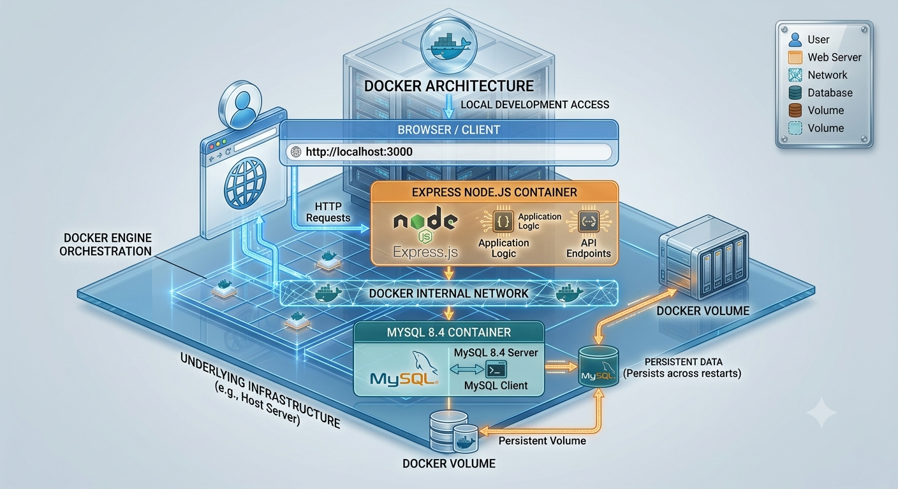
</p>
---

# 🔄 Project Workflow

```

          Client

             │

             ▼

      REST API Request

             │

             ▼

      Express.js Server

             │

             ▼

     MySQL Database Query

             │

             ▼

     Execute SQL Operation

             │

             ▼

       Return JSON Response

             │

             ▼

           Client

```

---

# 📂 Project Structure

```

dockerized-student-management/

│

├── server.js

├── db.js

├── Dockerfile

├── docker-compose.yml

├── package.json

├── package-lock.json

├── .env.example

├── .dockerignore

├── .gitignore

├── README.md

│

└── screenshots/

      ├── architecture.png

      ├── docker-containers.png

      ├── thunder-get.png

      ├── thunder-post.png

      ├── thunder-put.png

      ├── thunder-delete.png

      ├── mysql-table.png

      └── docker-compose.png

```

---

# 📌 How This Project Works

This application consists of two Docker containers.

### 1️⃣ Node.js Container

- Runs the Express.js backend application.
- Receives HTTP requests from the client.
- Performs CRUD operations.
- Connects to the MySQL container using Docker networking.
- Returns JSON responses.

---

### 2️⃣ MySQL Container

- Stores student information.
- Executes SQL queries.
- Persists data using Docker Volumes.
- Communicates only with the Node.js container.

---

### 3️⃣ Docker Network

Docker Compose automatically creates a private bridge network.

Instead of using an IP address, the Node.js application connects to MySQL using the service name:

```javascript
host: "mysql-db";
```

Docker automatically resolves this hostname to the correct container.

---

### 4️⃣ Docker Volume

The MySQL database stores its data inside a Docker Volume.

Because of this, even if the MySQL container is removed and recreated, the student records remain intact.

This demonstrates one of Docker's most important concepts: **persistent storage**.

---

# 🚀 Project Highlights

This project demonstrates the following Docker concepts:

- Docker Images
- Docker Containers
- Dockerfile
- Docker Hub
- Docker Networking
- Docker Volumes
- Docker Compose
- Environment Variables
- Container Communication
- Persistent Storage
- Multi-Container Applications

It also demonstrates backend development concepts including:

- REST APIs
- CRUD Operations
- Express.js
- MySQL Integration
- JSON APIs
- SQL Queries
- Error Handling

---

---

# 💻 Prerequisites

Before running this project, ensure the following software is installed on your machine.

| Software       | Version       |
| -------------- | ------------- |
| Node.js        | 22.x or later |
| Docker Desktop | Latest        |
| Docker Compose | v2            |
| Git            | Latest        |
| VS Code        | Recommended   |

Verify the installation:

```bash
node -v
npm -v
docker --version
docker compose version
git --version
```

---

# 📥 Clone the Repository

```bash
git clone https://github.com/asdweb22/dockerized-student-management.git
```

Go inside the project.

```bash
cd dockerized-student-management
```

---

# ⚙ Environment Variables

Create a `.env` file in the project root.

Example:

```env
PORT=3000

DB_HOST=mysql-db
DB_PORT=3306
DB_USER=root
DB_PASSWORD=root123
DB_NAME=studentdb

MYSQL_ROOT_PASSWORD=root123
MYSQL_DATABASE=studentdb
```

> **Note:** Never commit your real `.env` file to GitHub. Instead, include a `.env.example` file.

---

# 📦 Install Dependencies

If running the application locally without Docker:

```bash
npm install
```

Installed packages include:

- Express.js
- MySQL2
- Dotenv

---

# 🐳 Dockerfile Overview

The Dockerfile is responsible for creating the Node.js application image.

Main responsibilities:

- Uses lightweight Alpine Linux
- Copies application source code
- Installs dependencies
- Exposes port 3000
- Starts the Express server

### Build Docker Image

```bash
docker build -t student-node-app .
```

### Verify Image

```bash
docker images
```

---

# 📦 Docker Compose Overview

Docker Compose allows us to manage multiple containers using a single YAML configuration.

Instead of manually creating:

- Network
- MySQL Container
- Node.js Container
- Volume

Docker Compose creates everything automatically.

### Start Application

```bash
docker compose up -d --build
```

### Stop Application

```bash
docker compose down
```

### Stop and Remove Volumes

```bash
docker compose down -v
```

---

# 🌐 Docker Networking

Docker Compose automatically creates a bridge network.

Both services join the same network.

```
Node.js
     │
     │
Docker Network
     │
     │
MySQL
```

The Node.js application communicates with MySQL using the service name.

```javascript
host: "mysql-db";
```

Docker automatically resolves this hostname internally.

No IP address configuration is required.

---

# 💾 Docker Volume

The MySQL database stores its data inside a Docker Volume.

Benefits include:

- Persistent storage
- Data survives container deletion
- Easy backup
- Easy migration

Volume used in this project:

```yaml
volumes:
  mysql-data:
```

Container mapping:

```yaml
volumes:
  - mysql-data:/var/lib/mysql
```

---

# 🚀 Running the Project

Build and start all services:

```bash
docker compose up -d --build
```

Verify running containers:

```bash
docker ps
```

Expected output:

```
student-node-app-container
mysql-container
```

Check logs:

```bash
docker compose logs
```

Check Node logs:

```bash
docker compose logs node-app
```

Check MySQL logs:

```bash
docker compose logs mysql-db
```

---

# 📁 Project Configuration Files

| File               | Purpose                                             |
| ------------------ | --------------------------------------------------- |
| Dockerfile         | Builds the Node.js image                            |
| docker-compose.yml | Runs the complete application                       |
| .env               | Environment variables                               |
| .env.example       | Sample configuration                                |
| .dockerignore      | Excludes unnecessary files during image build       |
| .gitignore         | Prevents sensitive/local files from being committed |
| package.json       | Project metadata and dependencies                   |
| db.js              | Database connection pool                            |
| server.js          | Express application and REST APIs                   |

---

# 🔗 REST API Documentation

The Student Management System follows REST (Representational State Transfer) principles.

The API allows clients to perform CRUD (Create, Read, Update, Delete) operations on student records stored in the MySQL database.

## Base URL

When running locally:

```text
http://localhost:3000
```

---

# 📋 API Endpoints

| Method | Endpoint        | Description          |
| ------ | --------------- | -------------------- |
| GET    | `/`             | Welcome API          |
| GET    | `/students`     | Get all students     |
| GET    | `/students/:id` | Get student by ID    |
| POST   | `/students`     | Create a new student |
| PUT    | `/students/:id` | Update a student     |
| DELETE | `/students/:id` | Delete a student     |

---

# 🏠 Home Endpoint

Returns a welcome message.

### Request

```http
GET /
```

### Response

```json
{
  "message": "Student Management API using Node.js + MySQL + Docker"
}
```

**HTTP Status:** `200 OK`

---

# 📖 Get All Students

Returns all student records stored in the database.

### Request

```http
GET /students
```

### Sample Response

```json
[
  {
    "id": 1,
    "name": "Akshay",
    "age": 25,
    "course": "AWS"
  },
  {
    "id": 2,
    "name": "Rahul",
    "age": 23,
    "course": "Node.js"
  }
]
```

**HTTP Status:** `200 OK`

---

# 🔍 Get Student by ID

Returns a single student using its unique ID.

### Request

```http
GET /students/1
```

### Success Response

```json
{
  "id": 1,
  "name": "Akshay",
  "age": 25,
  "course": "AWS"
}
```

**HTTP Status:** `200 OK`

### Student Not Found

```json
{
  "message": "Student not found"
}
```

**HTTP Status:** `404 Not Found`

---

# ➕ Create Student

Creates a new student record.

### Request

```http
POST /students
```

### Request Body

```json
{
  "name": "Priya",
  "age": 24,
  "course": "Docker"
}
```

### Success Response

```json
{
  "message": "Student created successfully",
  "id": 3
}
```

**HTTP Status:** `201 Created`

---

# ✏️ Update Student

Updates an existing student.

### Request

```http
PUT /students/1
```

### Request Body

```json
{
  "name": "Akshay",
  "age": 26,
  "course": "AWS & Docker"
}
```

### Success Response

```json
{
  "message": "Student updated successfully"
}
```

**HTTP Status:** `200 OK`

### Student Not Found

```json
{
  "message": "Student not found"
}
```

**HTTP Status:** `404 Not Found`

---

# ❌ Delete Student

Deletes a student from the database.

### Request

```http
DELETE /students/2
```

### Success Response

```json
{
  "message": "Student deleted successfully"
}
```

**HTTP Status:** `200 OK`

### Student Not Found

```json
{
  "message": "Student not found"
}
```

**HTTP Status:** `404 Not Found`

---

# 📡 HTTP Status Codes

| Status Code | Meaning                        |
| ----------- | ------------------------------ |
| 200         | Request completed successfully |
| 201         | Resource created successfully  |
| 404         | Resource not found             |
| 500         | Internal server error          |

---

# 🧪 API Testing

The APIs were tested using **Thunder Client** inside Visual Studio Code.

The following operations were verified successfully:

- ✅ Get All Students
- ✅ Get Student by ID
- ✅ Create Student
- ✅ Update Student
- ✅ Delete Student

---

# 📸 API Screenshots

## Get All Students

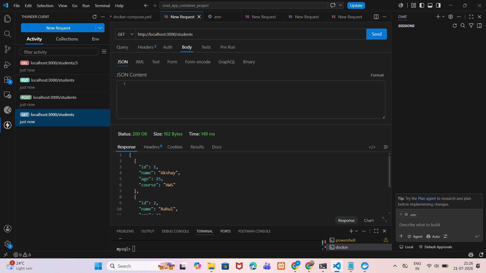


---

## Get Student by ID

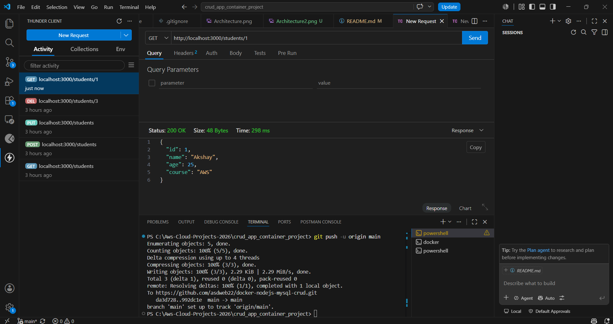

---

## Create Student

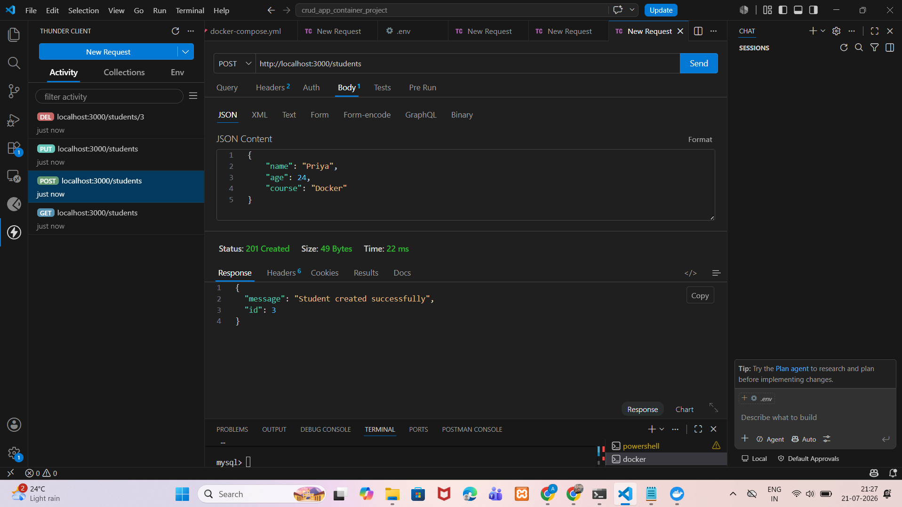
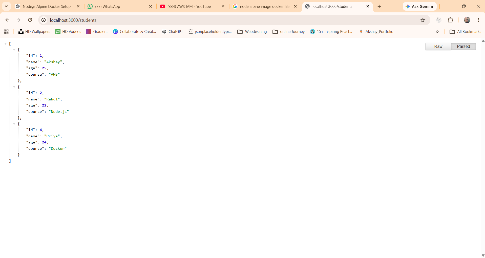

---

## Update Student

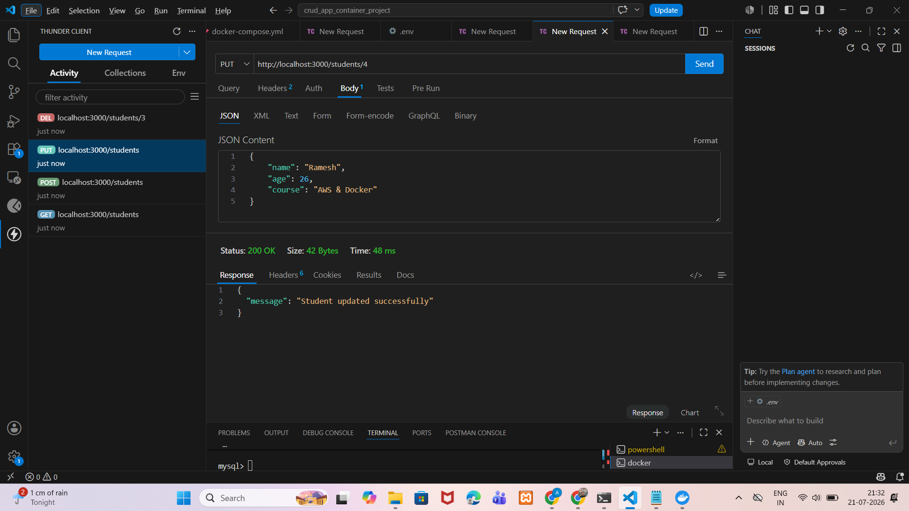
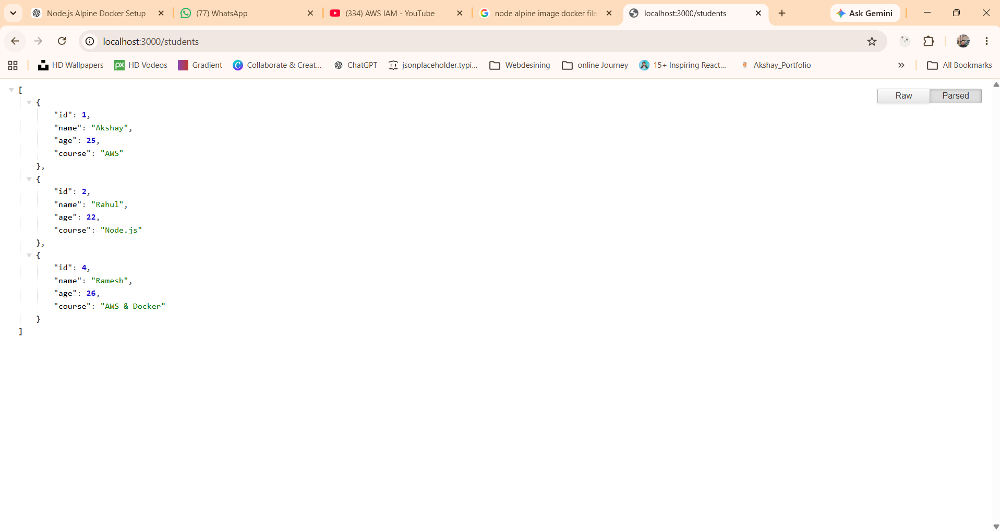

---

## Delete Student

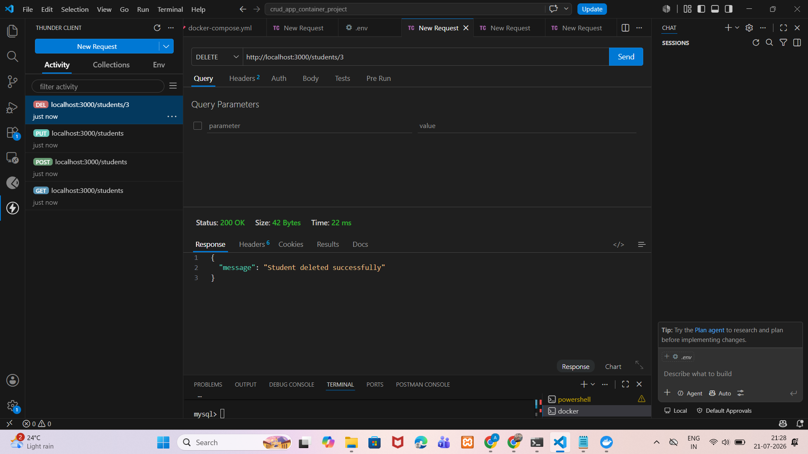

---

# 🔄 Complete API Request Flow

```text
                 Client

                    │

                    ▼

        HTTP Request (GET/POST/PUT/DELETE)

                    │

                    ▼

            Express.js Router

                    │

                    ▼

          Business Logic (server.js)

                    │

                    ▼

         MySQL Connection (db.js)

                    │

                    ▼

            MySQL Database

                    │

                    ▼

              SQL Execution

                    │

                    ▼

             JSON Response

                    │

                    ▼

                 Client
```

---

# 🛡 Error Handling

The application returns meaningful HTTP status codes and JSON responses.

### Example

```json
{
  "message": "Student not found"
}
```

Unexpected server errors return:

```json
{
  "error": "Internal Server Error"
}
```

---

# 📌 REST Principles Followed

- Resource-based endpoints
- Appropriate HTTP methods
- JSON request and response bodies
- Standard HTTP status codes
- Stateless communication
- Clear URI naming conventions
- Proper separation of concerns

---

# 🚀 API Summary

This REST API demonstrates:

- CRUD operations
- Express.js routing
- MySQL database integration
- Docker container communication
- Error handling
- JSON serialization
- HTTP status code usage
- Production-style API organization

---

# 🗄 Database Design

The application stores all student information inside a MySQL database.

## Database Name

```sql
studentdb
```

## Table Name

```sql
students
```

---

# 📑 Database Schema

| Column | Data Type    | Description                  |
| ------ | ------------ | ---------------------------- |
| id     | INT          | Primary Key (Auto Increment) |
| name   | VARCHAR(100) | Student Name                 |
| age    | INT          | Student Age                  |
| course | VARCHAR(100) | Course Name                  |

---

# 🛠 SQL Table Definition

```sql
CREATE TABLE students(
    id INT AUTO_INCREMENT PRIMARY KEY,
    name VARCHAR(100),
    age INT,
    course VARCHAR(100)
);
```

---

# 🏛 Database Architecture

```
            Node.js Container

                   │

             SQL Queries

                   │

                   ▼

           MySQL Container

                   │

         Docker Volume Storage

                   │

                   ▼

        Persistent Database Data
```

---

# 🐳 Dockerfile Explanation

The Dockerfile is responsible for creating the Node.js application image.

| Instruction         | Description                         |
| ------------------- | ----------------------------------- |
| FROM node:22-alpine | Uses lightweight Alpine Linux image |
| WORKDIR /app        | Creates application directory       |
| COPY package\*.json | Copies dependency files             |
| RUN npm install     | Installs dependencies               |
| COPY . .            | Copies project files                |
| EXPOSE 3000         | Opens application port              |
| CMD ["npm","start"] | Starts Express server               |

---

# ⚙ Docker Compose Explanation

The docker-compose.yml file orchestrates multiple containers.

## Services

### Node Application

Responsible for:

- Running Express.js
- Handling REST APIs
- Connecting to MySQL
- Returning JSON responses

---

### MySQL

Responsible for:

- Storing student data
- Executing SQL queries
- Persisting data using Docker Volumes

---

### Docker Volume

Purpose:

- Persistent storage
- Data backup
- Container recreation without data loss

---

# 🔄 Container Startup Flow

```
docker compose up

       │

       ▼

Build Node Image

       │

       ▼

Create Network

       │

       ▼

Create Volume

       │

       ▼

Start MySQL Container

       │

       ▼

Start Node Container

       │

       ▼

Application Ready
```

---

# 📂 Source Code Overview

## server.js

Responsible for:

- Express Server
- API Routes
- CRUD Operations
- Request Handling
- Response Handling

---

## db.js

Responsible for:

- MySQL Connection Pool
- Database Connectivity
- SQL Query Execution

---

## Dockerfile

Responsible for:

- Building Node.js Image

---

## docker-compose.yml

Responsible for:

- Starting Multiple Containers
- Docker Networking
- Volume Mounting
- Environment Variables

---

# 💡 Design Decisions

This project follows several software engineering best practices.

✔ Separation of Concerns

✔ Containerized Architecture

✔ Environment Variable Configuration

✔ Persistent Database Storage

✔ RESTful API Design

✔ Reusable Database Connection Pool

✔ Docker Compose Orchestration

✔ Modular Project Structure

---

# 📈 Request Lifecycle

```
HTTP Request

      │

      ▼

Express Router

      │

      ▼

Business Logic

      │

      ▼

MySQL Query

      │

      ▼

Database

      │

      ▼

JSON Response
```

---

# 📸 Project Screenshots

## 🏗 Project Architecture

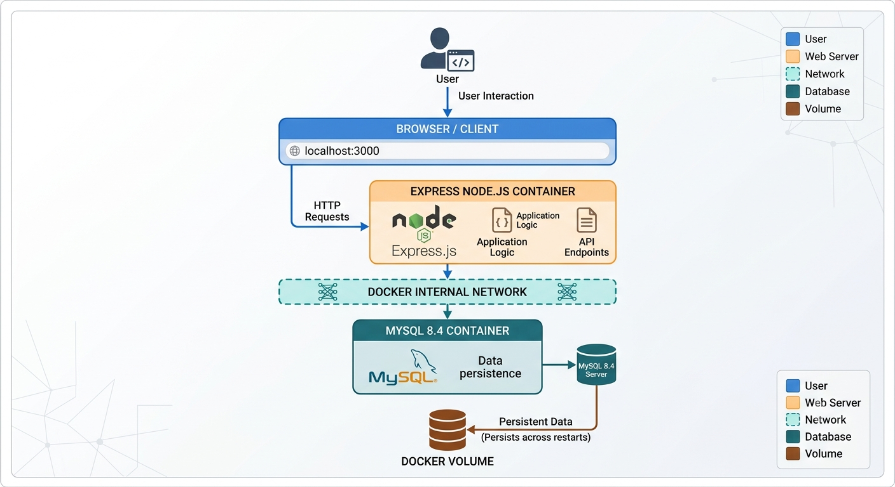

---

## 🐳 Docker Images

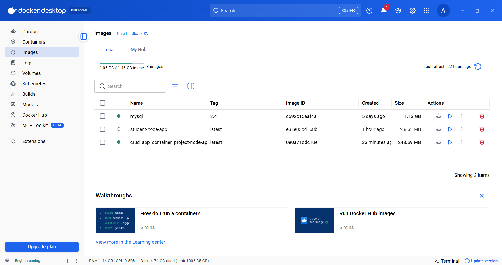

---

## 📦 Running Containers


---

## 🌐 Docker Network

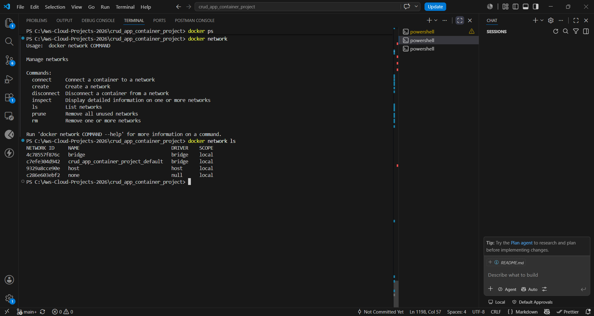

---

## 💾 Docker Volume

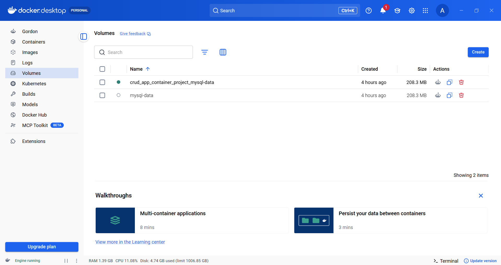

---

## 🚀 Docker Compose

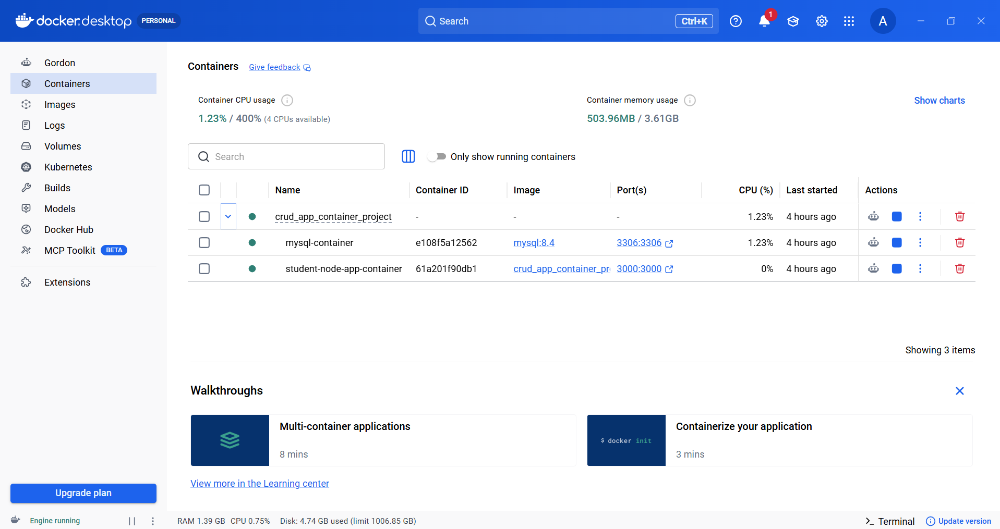

---

## 🗄 MySQL Database

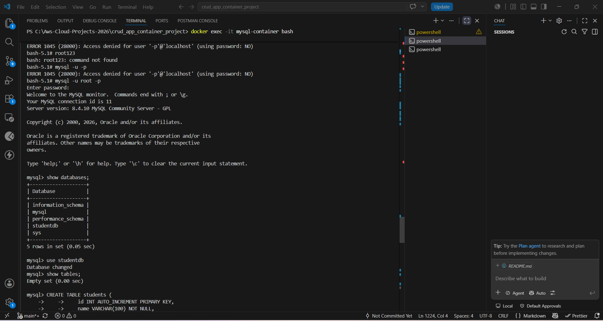
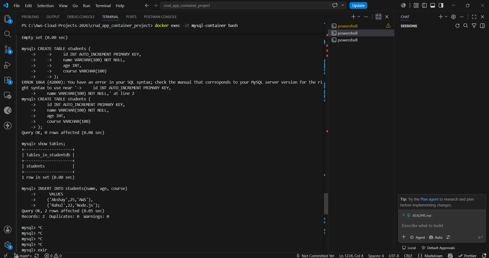

---

# 🐳 Complete Docker Command Reference

This project uses the following Docker commands during development and testing.

## 📦 Docker Images

### Build Docker Image

```bash
docker build -t student-node-app .
```

### List Docker Images

```bash
docker images
```

### Remove Docker Image

```bash
docker rmi student-node-app
```

### Force Remove Docker Image

```bash
docker rmi -f student-node-app
```

---

# 📦 Docker Containers

### Create and Run Container

```bash
docker run -d --name student-node-app-container -p 3000:3000 student-node-app
```

### List Running Containers

```bash
docker ps
```

### List All Containers

```bash
docker ps -a
```

### Stop Container

```bash
docker stop student-node-app-container
```

### Start Existing Container

```bash
docker start student-node-app-container
```

### Restart Container

```bash
docker restart student-node-app-container
```

### Remove Container

```bash
docker rm student-node-app-container
```

### Force Remove Container

```bash
docker rm -f student-node-app-container
```

### Rename Container

```bash
docker rename old-container-name new-container-name
```

---

# 📜 Container Logs

### View Logs

```bash
docker logs student-node-app-container
```

### Follow Logs

```bash
docker logs -f student-node-app-container
```

### View Last 50 Log Lines

```bash
docker logs --tail 50 student-node-app-container
```

---

# 💻 Execute Commands Inside Container

### Open Bash Shell

```bash
docker exec -it mysql-container bash
```

### Open Sh Shell (Alpine Images)

```bash
docker exec -it student-node-app-container sh
```

### Run MySQL Client

```bash
mysql -u root -p
```

---

# 🌐 Docker Networks

### List Networks

```bash
docker network ls
```

### Create Network

```bash
docker network create student-network
```

### Inspect Network

```bash
docker network inspect student-network
```

### Connect Container to Network

```bash
docker network connect student-network student-node-app-container
```

### Disconnect Container

```bash
docker network disconnect student-network student-node-app-container
```

### Remove Network

```bash
docker network rm student-network
```

---

# 💾 Docker Volumes

### List Volumes

```bash
docker volume ls
```

### Create Volume

```bash
docker volume create mysql-data
```

### Inspect Volume

```bash
docker volume inspect mysql-data
```

### Remove Volume

```bash
docker volume rm mysql-data
```

### Remove Unused Volumes

```bash
docker volume prune
```

---

# 📋 Docker Inspect Commands

### Inspect Container

```bash
docker inspect student-node-app-container
```

### Inspect Image

```bash
docker image inspect student-node-app
```

---

# 📊 Docker Resource Usage

### View Running Container Resource Usage

```bash
docker stats
```

### View Single Container Resource Usage

```bash
docker stats student-node-app-container
```

---

# 🧹 Docker Cleanup

### Remove Stopped Containers

```bash
docker container prune
```

### Remove Unused Images

```bash
docker image prune
```

### Remove All Unused Resources

```bash
docker system prune
```

### Remove Everything (Including Volumes)

```bash
docker system prune -a --volumes
```

---

# 🐳 Docker Compose Commands

### Build Containers

```bash
docker compose build
```

### Build Without Cache

```bash
docker compose build --no-cache
```

### Start Containers

```bash
docker compose up
```

### Start in Detached Mode

```bash
docker compose up -d
```

### Build and Start

```bash
docker compose up -d --build
```

### Stop Containers

```bash
docker compose stop
```

### Start Existing Containers

```bash
docker compose start
```

### Restart Containers

```bash
docker compose restart
```

### View Running Services

```bash
docker compose ps
```

### View Logs

```bash
docker compose logs
```

### Follow Logs

```bash
docker compose logs -f
```

### Stop and Remove Containers

```bash
docker compose down
```

### Remove Containers and Volumes

```bash
docker compose down -v
```

### Remove Containers, Images, and Volumes

```bash
docker compose down --rmi all -v
```

---

# 🔍 Verification Commands

### Verify Docker Installation

```bash
docker --version
```

### Verify Docker Compose

```bash
docker compose version
```

### Display Docker Information

```bash
docker info
```

### Display Docker System Usage

```bash
docker system df
```

---

# 📚 Commands Used in This Project

| Command                        | Purpose                      |
| ------------------------------ | ---------------------------- |
| `docker build`                 | Build Node.js Docker image   |
| `docker images`                | List images                  |
| `docker run`                   | Run Node.js container        |
| `docker ps`                    | List running containers      |
| `docker ps -a`                 | List all containers          |
| `docker logs`                  | View application logs        |
| `docker exec -it`              | Access container terminal    |
| `docker network create`        | Create Docker network        |
| `docker network ls`            | List networks                |
| `docker volume create`         | Create persistent volume     |
| `docker volume ls`             | List volumes                 |
| `docker compose up -d --build` | Build and start all services |
| `docker compose ps`            | List Compose services        |
| `docker compose logs`          | View service logs            |
| `docker compose down`          | Stop services                |

---

# 📚 Learning Outcomes

This project helped in understanding:

- Docker Images
- Docker Containers
- Docker Networking
- Docker Volumes
- Docker Compose
- Environment Variables
- Express.js
- REST APIs
- MySQL Integration
- CRUD Operations
- Multi-container Applications

---

# 🚀 Future Enhancements

The following improvements can be added in future versions:

- JWT Authentication
- User Login System
- Role Based Access Control (RBAC)
- Swagger/OpenAPI Documentation
- Input Validation
- Unit Testing
- Logging using Winston
- Rate Limiting
- Nginx Reverse Proxy
- Redis Caching
- Email Notifications
- Pagination & Search
- File Uploads using AWS S3

---

# ☁ AWS Deployment Roadmap

This project can be deployed on AWS using the following architecture:

```
GitHub

   │

GitHub Actions

   │

Docker Build

   │

Amazon ECR

   │

Amazon ECS / EC2

   │

Application Load Balancer

   │

Users
```

Future AWS services:

- Amazon EC2
- Amazon ECS
- Amazon ECR
- Application Load Balancer
- Amazon RDS MySQL
- Amazon CloudWatch
- IAM
- Route 53
- AWS Certificate Manager
- AWS Secrets Manager

---

# 🔄 CI/CD Pipeline (Future)

```
Developer

      │

Push Code

      │

GitHub

      │

GitHub Actions

      │

Build Docker Image

      │

Push to Amazon ECR

      │

Deploy to ECS/EC2

      │

Production
```

---

# ☸ Kubernetes Migration

This project can also be migrated to Kubernetes.

Possible Kubernetes resources:

- Deployment
- Service
- ConfigMap
- Secret
- Persistent Volume
- Persistent Volume Claim
- Ingress

---

# 🎯 Resume Project Description

### Dockerized Student Management System

Developed a production-style multi-container CRUD application using Node.js, Express.js, MySQL, Docker, and Docker Compose. Implemented RESTful APIs, persistent database storage using Docker Volumes, environment variable management, and inter-container communication through Docker Networking. Demonstrated containerization, orchestration, and backend application development following industry best practices.

---

# 💼 Key Skills Demonstrated

- Docker
- Docker Compose
- Node.js
- Express.js
- MySQL
- REST APIs
- CRUD Operations
- Environment Variables
- Docker Networking
- Docker Volumes
- Git
- GitHub

---

# 📌 Project Highlights

✔ Lightweight Docker Image

✔ Multi-container Architecture

✔ Persistent Database Storage

✔ Environment Variable Configuration

✔ Production-style Project Structure

✔ RESTful API Design

✔ MySQL Integration

✔ Docker Compose Orchestration

---

# 🤝 Contributing

Contributions are welcome.

1. Fork the repository.

2. Create a new feature branch.

3. Commit your changes.

4. Push the branch.

5. Open a Pull Request.

---

# 📄 License

This project is licensed under the MIT License.

---

# 👨‍💻 Author

**Akshay Dhongade**

AWS Cloud | DevOps | Full Stack Developer

GitHub: https://github.com/asdweb22

LinkedIn: https://www.linkedin.com/in/iamakshaydhongade/

Portfolio: https://asdweb22.github.io/akshay_portfolio_demo/

---

# ⭐ Support

If you found this project useful, consider giving it a ⭐ on GitHub. It helps others discover the project and motivates future improvements.

---

# 🙏 Acknowledgements

Thanks to the open-source community and the maintainers of:

- Node.js
- Express.js
- MySQL
- Docker
- Docker Compose
- Git
- GitHub

for providing the tools and technologies that made this project possible.
